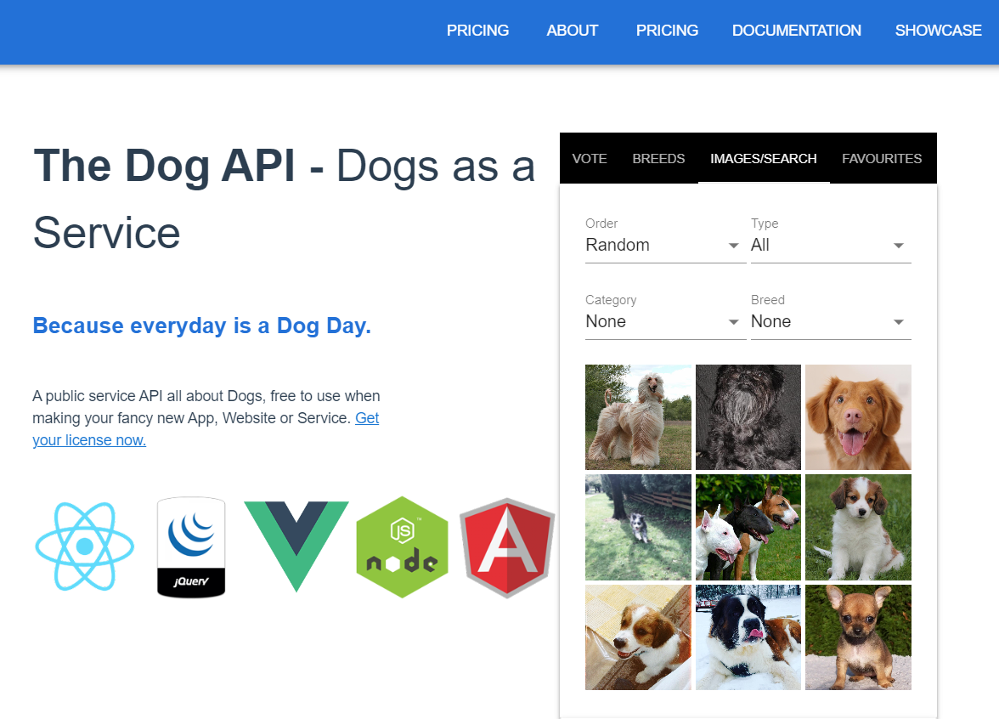

# DogsAPI
Project consisting on consuming **The Dog API** for retrieving images. It is a free service that provides images of dogs and other information:

The program creates an HTTP connection to The Dog API, runs the result through a JSON parser and populates a list with the relevant information. It then attempts to download 10 of them and save them to locally:

**TO DO:** Expand the project and implement other functionalities based on the other features the API provides.

**KNOWN ISSUES:** At this moment, the program has trouble dealing with non-JPG files and fails to correctly download them, even though it may appear to do so. Error "Bogus input colorspace" may also occur.
